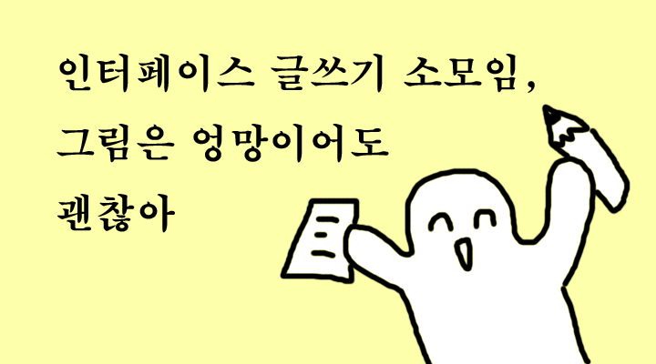

# InterfaceWritingCircle

인터페이스글쓰기소모임

```
📢공지사항-디코 채널. 2021.01.20. 익명의 서버 관리자

@everyone 인터페이스글쓰기소모임 관련 채널 2개가 신설되었습니다.
운영하시는 블로그 링크를 ✨블로그-목록 채널에 올려주시면 🔥블로그-피드 채널 피드에 올라가도록 추가하겠습니다.
이후 작성하신 글은 디스코드 봇 INTERFACE.RSS 을 통해 커뮤니티 서버에 자동으로 업데이트 됩니다.
이를 통해 인터페이스 부원들이 어떤 분야에 관심이 있고, 어떤 걸 공부하고 있는지 등에 대해 활발히 교류할 수 있길 바랍니다. 😊
```

## 주요 활동
- 회고록을 작성하고, 회고 모임을 진행합니다.
- 인터페이스 부원들이 지속 가능한 글쓰기 활동을 하려면 어떻게 해야할 지 고민합니다.
- 인터페이스 디스코드 커뮤니티 서버의 INTERFACE.RSS 봇을 관리합니다.
- [인페인들의 회고 모음](https://github.com/sejonginterface/interface-retrospective)에 자신이 작성한 회고록을 업데이트 합니다.


<details>
    <summary> ✨ </summary>
    <div markdown="1">
        <p align="center">
             </br>
            <sub> 소모임 처음 만들었을 때 홍보용으로 사용했던 이미지 😉 </sub>
        </p>
    </div>
    
</details>

